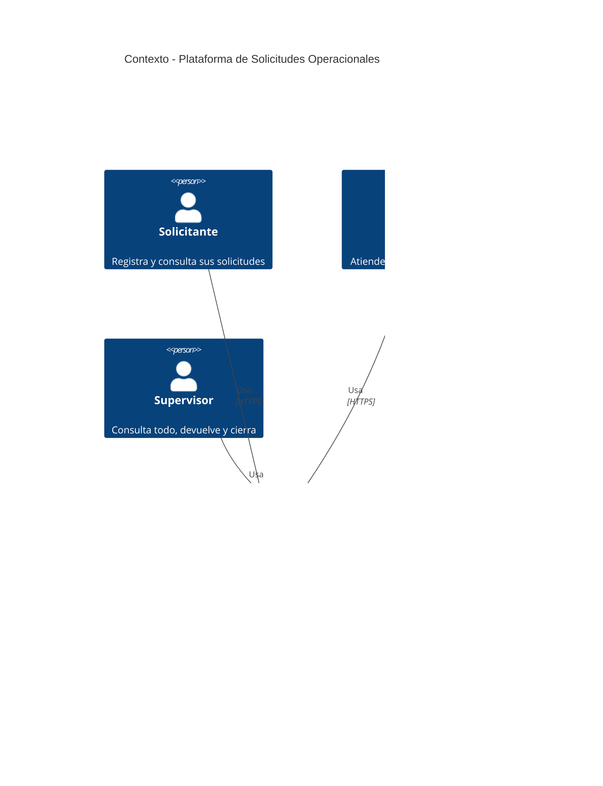
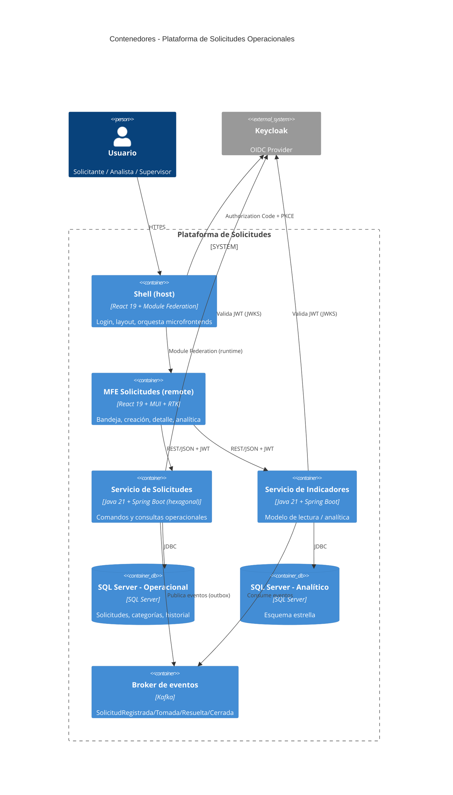

# C4 — Contexto y Contenedores

## Nivel 1 — Contexto

```mermaid
C4Context
    title Contexto - Plataforma de Solicitudes Operacionales

    Person(solicitante, "Solicitante", "Registra y consulta sus solicitudes")
    Person(analista, "Analista", "Atiende y resuelve solicitudes")
    Person(supervisor, "Supervisor", "Consulta todo, devuelve y cierra")

    System(plataforma, "Plataforma de Solicitudes", "Registro, asignación y seguimiento de solicitudes operacionales")
    System_Ext(keycloak, "Keycloak", "Identity Provider (OIDC)")

    Rel(solicitante, plataforma, "Usa", "HTTPS")
    Rel(analista, plataforma, "Usa", "HTTPS")
    Rel(supervisor, plataforma, "Usa", "HTTPS")
    Rel(plataforma, keycloak, "Autentica/Autoriza", "OIDC/JWT")
```

## Nivel 2 — Contenedores

```mermaid
C4Container
    title Contenedores - Plataforma de Solicitudes Operacionales

    Person(usuario, "Usuario", "Solicitante / Analista / Supervisor")

    System_Boundary(plataforma, "Plataforma de Solicitudes") {
        Container(shell, "Shell (host)", "React 19 + Module Federation", "Login, layout, orquesta microfrontends")
        Container(mfe, "MFE Solicitudes (remote)", "React 19 + MUI + RTK", "Bandeja, creación, detalle, analítica")
        Container(solicitudesSvc, "Servicio de Solicitudes", "Java 21 + Spring Boot (hexagonal)", "Comandos y consultas operacionales")
        Container(indicadoresSvc, "Servicio de Indicadores", "Java 21 + Spring Boot", "Modelo de lectura / analítica")
        ContainerDb(sqlOper, "SQL Server - Operacional", "SQL Server", "Solicitudes, categorías, historial")
        ContainerDb(sqlAnalytics, "SQL Server - Analítico", "SQL Server", "Esquema estrella")
        Container(broker, "Broker de eventos", "Kafka", "SolicitudRegistrada/Tomada/Resuelta/Cerrada")
    }

    System_Ext(keycloak, "Keycloak", "OIDC Provider")

    Rel(usuario, shell, "HTTPS")
    Rel(shell, mfe, "Module Federation (runtime)")
    Rel(shell, keycloak, "Authorization Code + PKCE")
    Rel(mfe, solicitudesSvc, "REST/JSON + JWT")
    Rel(mfe, indicadoresSvc, "REST/JSON + JWT")
    Rel(solicitudesSvc, sqlOper, "JDBC")
    Rel(solicitudesSvc, broker, "Publica eventos (outbox)")
    Rel(indicadoresSvc, broker, "Consume eventos")
    Rel(indicadoresSvc, sqlAnalytics, "JDBC")
    Rel(solicitudesSvc, keycloak, "Valida JWT (JWKS)")
    Rel(indicadoresSvc, keycloak, "Valida JWT (JWKS)")
```
