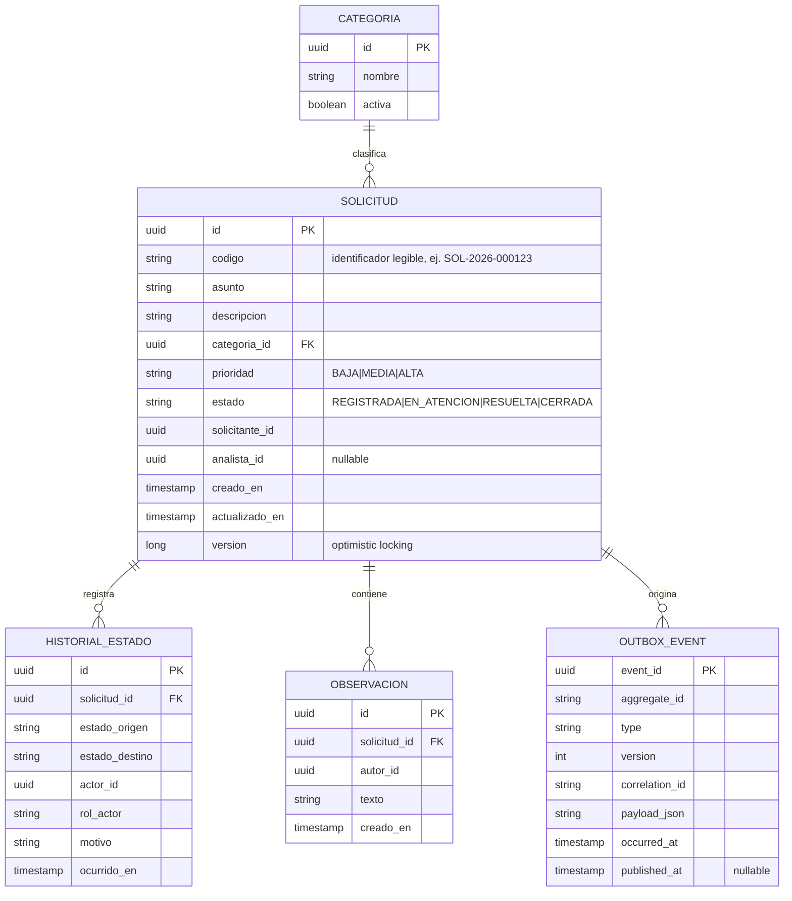
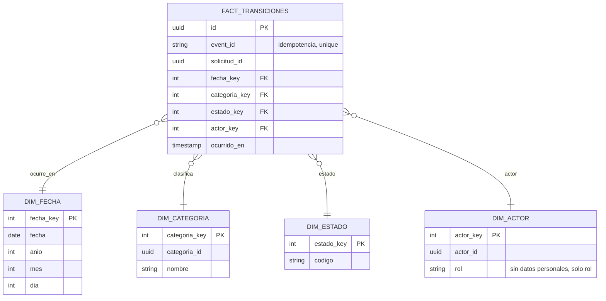

# Modelo de datos

## Operacional (normalizado) — `solicitudes-service`

## Analítico (estrella) — `indicadores-service`

Se evita replicar datos personales: `dim_actor` guarda únicamente `actor_id` (identificador técnico) y `rol`, no nombre/correo.
