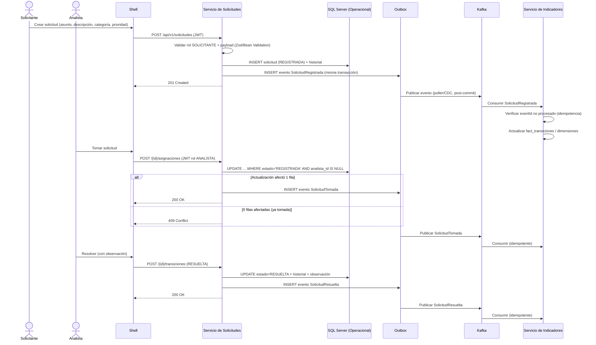

# Diagrama de secuencia — Flujo principal y eventos

## Notas de confiabilidad de eventos

- **Patrón Outbox**: el cambio de estado y el registro del evento se persisten en la misma transacción JDBC. Un publicador (poller programado o Debezium/CDC) lee la tabla `outbox_events` y publica a Kafka, marcando el evento como enviado. Esto evita publicar eventos de transacciones que luego hacen rollback, y evita perder eventos si el proceso cae antes de publicar (se reintenta desde la tabla).
- **Idempotencia en el consumidor**: `indicadores-service` registra `eventId` procesados (tabla `processed_events` con `UNIQUE (event_id)`) antes de aplicar la proyección; si el evento ya fue procesado, se descarta sin duplicar el conteo (cubre escenario A5).
